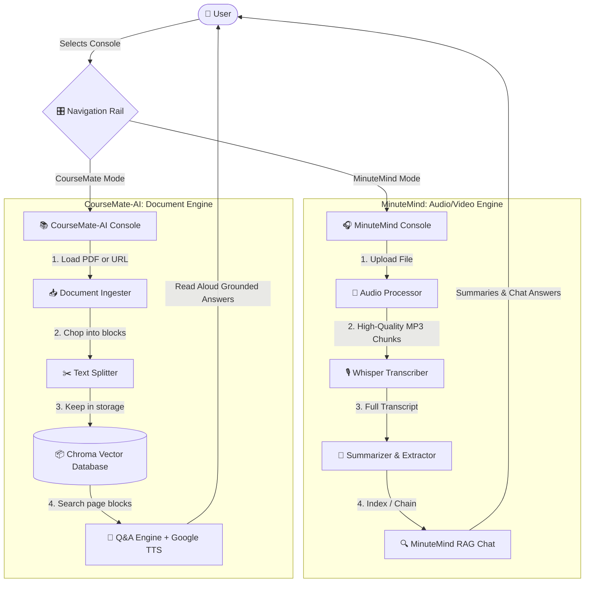

# 🔗 Unified AI Hub

Welcome to the **Unified AI Hub**! This is a single, beautiful dashboard that combines two clever AI twins: **MinuteMind** (for handling video/meeting audio) and **CourseMate-AI** (for chatting with document files & websites).

## 🏗️ Architecture Diagram

Below is the secret map showing how the robots process your files:



---

## 🚀 Running the Application

To run the unified dashboard:

1. **Install requirements**:
   ```bash
   pip install -r requirements.txt
   ```

2. **Start the app**:
   ```bash
   streamlit run "app(1).py"
   ```

---

## 🛠️ Features Mapped

### 1. MinuteMind (Video Intelligence Channel)
* **Audio Capture**: Handles large videos/audio files, chunking them down safely under `25MB`.
* **Super-Fast Transcripts**: Transcribes via Groq API.
* **Instant Extractions**: In one run, finds your **Action Items**, **Key Decisions**, and **Unresolved Questions**.
* **Chat Space**: A chat interface to talk directly to your video transcript.

### 2. CourseMate-AI (Document Grounding Channel)
* **Multi-Format Ingest**: Upload dry PDFs or provide live Web URLs.
* **Smart Storage**: Uses Chroma DB folder to persist the document blocks.
* **Dual Engines**: Supports Gemini models (Flash, Flash-Lite, Pro) and Mistral models.
* **Voice Power**: Query by voice using your microphone; have answers read back to you with custom TTS styles.

---

## ⚙️ Configuration Setup

Configure your API keys in the `.env` file at the root of the project:

```ini
GEMINI_API_KEY="your-gemini-key"
MISTRAL_API_KEY="your-mistral-key"
GROQ_API_KEY="your-groq-key"
```
